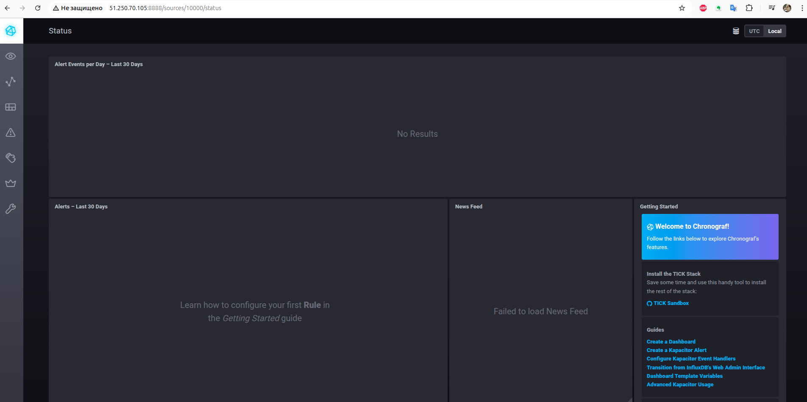
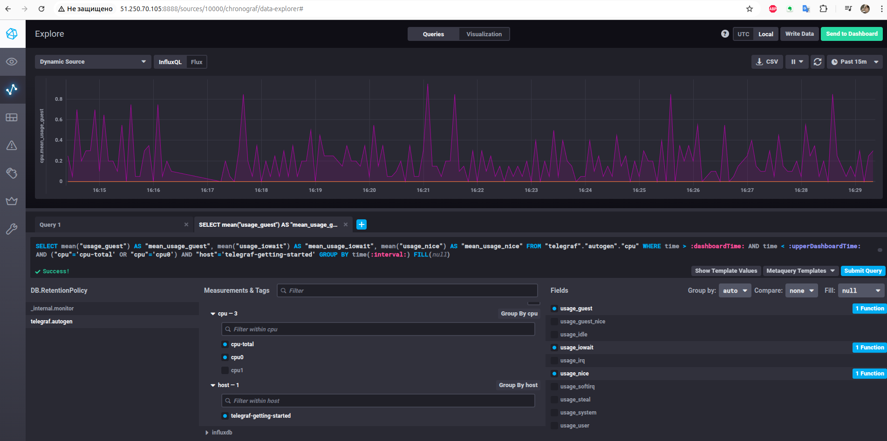
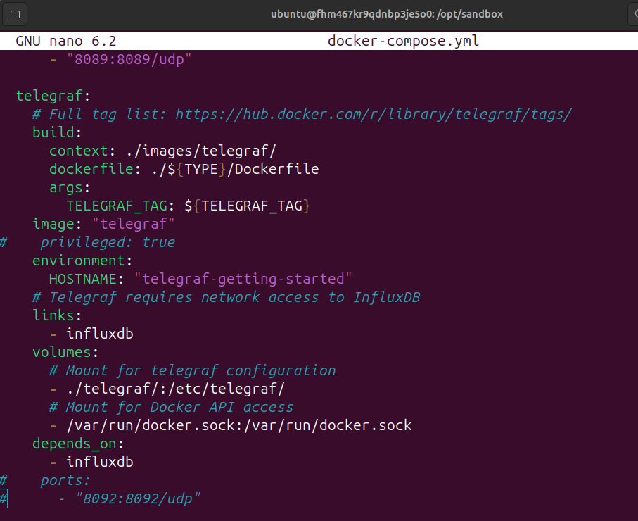
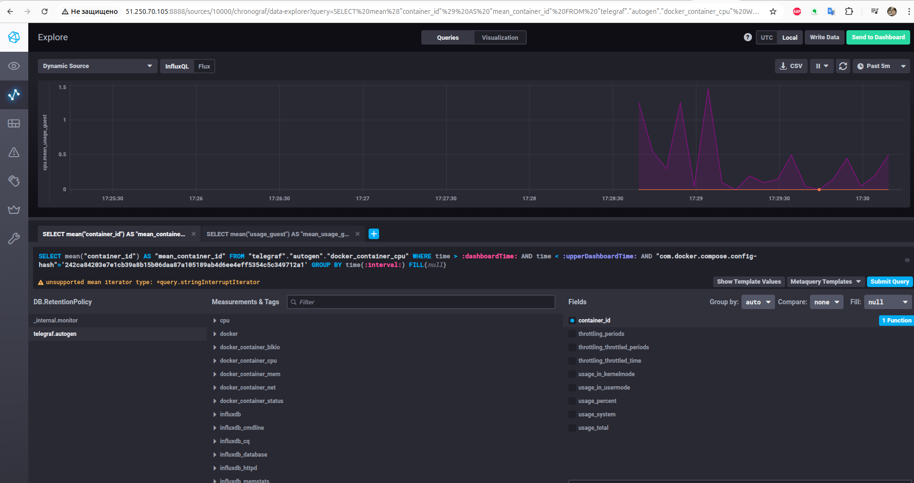
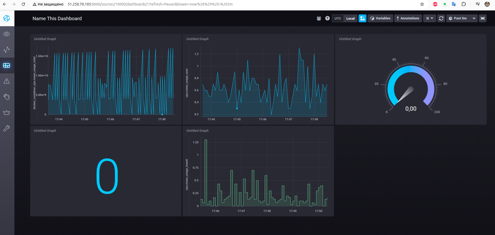

# Домашнее задание к занятию "13.Системы мониторинга"

## Обязательные задания

1. Вас пригласили настроить мониторинг на проект. На онбординге вам рассказали, что проект представляет из себя 
платформу для вычислений с выдачей текстовых отчетов, которые сохраняются на диск. Взаимодействие с платформой 
осуществляется по протоколу http. Также вам отметили, что вычисления загружают ЦПУ. Какой минимальный набор метрик вы
выведите в мониторинг и почему?
#
# Ответ
- CPU Usage (Загрузка ЦПУ) - для того чтоб понять хватает ли процессора и нет ли необходимости в масштабировании или оптимизации.
- Memory Usage (Использование памяти) - чтоб понять не достигается ли предела и нет ли потеря производительности.
- Disk Usage/Input-Output(Использование диска и дисковые операции чтение запись) - раз идет сохранение на диск, то нужно отслеживать и интенсивность работы диска и свободное место на нем.
- HTTP Requests (запросы HTTP) - количество запросов, время ответа, ошибки (4хх, 5хх) и статусы ответов.
- Error Rates (уровни ошибок) - для стабильности работы продукта и оперативного исправления ошибок нужно отслеживать ошибки.
- Network Traffic (сетевой трафик) - интенсивность и частоту использования продукта, возможные аномалии и потенциальные проблемы безопасности, загрузка сетевого канала.

Получаем:
- базовое понимание состояния системы
- возможность выявить узкие места и предотвращать серьезные проблемы в работе платформы
- если будет дополнительная информация про систему - могут потребоваться и другие метрики
#
#
2. Менеджер продукта посмотрев на ваши метрики сказал, что ему непонятно что такое RAM/inodes/CPUla. Также он сказал, что хочет понимать, насколько мы выполняем свои обязанности перед клиентами и какое качество обслуживания. Что вы можете ему предложить?
#
# Ответ
Тут вначале надо понять подробнее, что это за продукт, распросив менеджера и команду разработки подробно о нем.
Если этот продукт ближе к обычному сайту то могу предложить:
  - средняя скорость обслуживания клиента - время отклика на HTTP запрос (Response Time)
  - Частота возникновения ошибок у клиентов при обращении к сайту - количество успешных запросов, количество ошибок 4xx и 5xx (HTTP Request Status)
  - среднее время безотказной работы (Uptime average)
  - удовлетворенность работы сайта клиентом - количество "звезд" или "улыбок", которые ставит клиент по завершении работы с сайтом (NPS)
  - количество жалоб от клиентов (особенно с тех. проблемами)
Если этот продукт связан с отчетами на диске, то возможно нужно придумать свой показатель (или несколько показателей), который будет учитывать:
  - инициацию создания отчета пользователем
  - сохранение отчета на диск (возможно с привлечением журнала работы системы)
  - при необходимости читать файл отчета на наличие в нем определенны данных (особенно если пользователь заполняет некую форму)
  - успешность прохождения всех доп. проверок при необходимости
#
#
3. Вашей DevOps команде в этом году не выделили финансирование на построение системы сбора логов. Разработчики в свою очередь хотят видеть все ошибки, которые выдают их приложения. Какое решение вы можете предпринять в этой ситуации, чтобы разработчики получали ошибки приложения?
#
#
# Ответ
Есть бесплатные решения:
- Elastic Stack - Elasticsearch, Logstash, Kibana, Beats
- Graylog - Graylog Server, Graylog Web Interface, Inputs, Streams, Alerts
- Grafana Loki
- Sentry
- VCG - Vector, ClickHouse, Grafana
Если денег и на железо (или место) тоже не выделяют - то можно использовать например бесплатое облачное решение Sentry или любое другое. Уже готовые бесплатные решения нет смысла искать - они все равно будут основаны на выше изложенных вариантах.
Можно локально хранить логи, но придется настраивать доступ разработчикам к ним или даже скрипты с Алертами и отправкой их разработчикам - при увеличении нагрузки все равно придется перейти к бесплатному решению из выше перечисленных.
Если у компании уже есть что-то типа Jira можно прикрутить автоматическое создание задач по ошибкам в логах приложения - но все равно со временем придется переходить на профессиональное решение.
Выбор решения будет зависеть от сроков и той инфраструктуры, которая уже есть в компании.
#
#
4. Вы, как опытный SRE, сделали мониторинг, куда вывели отображения выполнения SLA=99% по http кодам ответов. Вычисляете этот параметр по следующей формуле: summ_2xx_requests/summ_all_requests. Данный параметр не поднимается выше 70%, но при этом в вашей системе нет кодов ответа 5xx и 4xx. Где у вас ошибка?
#
#
# Ответ
Забыл о 3хх ошибках.
(summ_2xx_requests + summ_3xx_requests) / (summ_all_requests)
#
#
5. Опишите основные плюсы и минусы pull и push систем мониторинга.
#
#
# Ответ
Push:
    + централизация - проще настраивать
    + меньше нагрузки на системы с которых собираем данные
    - проблемы с масштабированием
    - нагрузка на основной сервер выше
    - зажержки в интервалах опросов
Pull:
    + нагрузка на основной сервер ниже
    + масштабируемость
    + проще отладка получения метрик с агентов
    - меньшая гибкость -- каждый агент надо настраивать отдельно (или автоматизировать процесс)
    - доп. нагрузка на хосты где стоят агенты
#
#
6. Какие из ниже перечисленных систем относятся к push модели, а какие к pull? А может есть гибридные?

    - Prometheus 
    - TICK
    - Zabbix
    - VictoriaMetrics
    - Nagios   
#
#
# Ответ
    - Prometheus - Pull
    - TICK - Push
    - Zabbix - Гибрид
    - VictoriaMetrics - Push
    - Nagios - Pull
#
#
7. Склонируйте себе [репозиторий](https://github.com/influxdata/sandbox/tree/master) и запустите TICK-стэк, 
используя технологии docker и docker-compose.

В виде решения на это упражнение приведите скриншот веб-интерфейса ПО chronograf (`http://localhost:8888`). 

P.S.: если при запуске некоторые контейнеры будут падать с ошибкой - проставьте им режим `Z`, например
`./data:/var/lib:Z`
#
#
# Ответ
Сервер создал terraform-ом
запустить-настроить пытался все Ансиблом - до конца не вышло пришлось руками:

- sudo chmod -R 777 ./chronograf/data/
- sudo chmod -R 777 ./telegraf/
- sudo chmod -R 777 ./documentation/
- sudo docker-compose up - из папки залитого Ансиблом проекта

.env прищлось заливать новый Ансиблом
TELEGRAF_TAG=latest
INFLUXDB_TAG=1.8
CHRONOGRAF_TAG=latest
KAPACITOR_TAG=latest
TYPE=latest

Рис.1

#
#
8. Перейдите в веб-интерфейс Chronograf (http://localhost:8888) и откройте вкладку Data explorer.
        
    - Нажмите на кнопку Add a query
    - Изучите вывод интерфейса и выберите БД telegraf.autogen
    - В `measurments` выберите cpu->host->telegraf-getting-started, а в `fields` выберите usage_system. Внизу появится график утилизации cpu.
    - Вверху вы можете увидеть запрос, аналогичный SQL-синтаксису. Поэкспериментируйте с запросом, попробуйте изменить группировку и интервал наблюдений.

Для выполнения задания приведите скриншот с отображением метрик утилизации cpu из веб-интерфейса.
#
#
# Ответ
Меню другое уже. Но нашел интуитивно.

Рис.2

#
#
9. Изучите список [telegraf inputs](https://github.com/influxdata/telegraf/tree/master/plugins/inputs). 
Добавьте в конфигурацию telegraf следующий плагин - [docker](https://github.com/influxdata/telegraf/tree/master/plugins/inputs/docker):
```
[[inputs.docker]]
  endpoint = "unix:///var/run/docker.sock"
```

Дополнительно вам может потребоваться донастройка контейнера telegraf в `docker-compose.yml` дополнительного volume и 
режима privileged:
```
  telegraf:
    image: telegraf:1.4.0
    privileged: true
    volumes:
      - ./etc/telegraf.conf:/etc/telegraf/telegraf.conf:Z
      - /var/run/docker.sock:/var/run/docker.sock:Z
    links:
      - influxdb
    ports:
      - "8092:8092/udp"
      - "8094:8094"
      - "8125:8125/udp"
```

После настройке перезапустите telegraf, обновите веб интерфейс и приведите скриншотом список `measurments` в 
веб-интерфейсе базы telegraf.autogen . Там должны появиться метрики, связанные с docker.

Факультативно можете изучить какие метрики собирает telegraf после выполнения данного задания.
#
#
# Ответ
Помоему уже все работало и так.
Вначале сделал по инструкции - все упало.
Потом вернул как было и нашел метрики докер контейнеров в интерфейсе :)

Рис.3


Рис.4

#
#
## Дополнительное задание (со звездочкой*) - необязательно к выполнению

1. Вы устроились на работу в стартап. На данный момент у вас нет возможности развернуть полноценную систему 
мониторинга, и вы решили самостоятельно написать простой python3-скрипт для сбора основных метрик сервера. Вы, как 
опытный системный-администратор, знаете, что системная информация сервера лежит в директории `/proc`. 
Также, вы знаете, что в системе Linux есть  планировщик задач cron, который может запускать задачи по расписанию.

Суммировав все, вы спроектировали приложение, которое:
- является python3 скриптом
- собирает метрики из папки `/proc`
- складывает метрики в файл 'YY-MM-DD-awesome-monitoring.log' в директорию /var/log 
(YY - год, MM - месяц, DD - день)
- каждый сбор метрик складывается в виде json-строки, в виде:
  + timestamp (временная метка, int, unixtimestamp)
  + metric_1 (метрика 1)
  + metric_2 (метрика 2)
  
     ...
     
  + metric_N (метрика N)
  
- сбор метрик происходит каждую 1 минуту по cron-расписанию

Для успешного выполнения задания нужно привести:

а) работающий код python3-скрипта,

б) конфигурацию cron-расписания,

в) пример верно сформированного 'YY-MM-DD-awesome-monitoring.log', имеющий не менее 5 записей,

P.S.: количество собираемых метрик должно быть не менее 4-х.
P.P.S.: по желанию можно себя не ограничивать только сбором метрик из `/proc`.

#
#
# Ответ
- [Ссылка на python3-скрипт](metric_exporter.py)
#
#

2. В веб-интерфейсе откройте вкладку `Dashboards`. Попробуйте создать свой dashboard с отображением:

    - утилизации ЦПУ
    - количества использованного RAM
    - утилизации пространства на дисках
    - количество поднятых контейнеров
    - аптайм
    - ...
    - фантазируйте)
    
#
#
# Ответ

Все не нашел...

Рис.5

#
#   ---

### Как оформить ДЗ?

Выполненное домашнее задание пришлите ссылкой на .md-файл в вашем репозитории.

---

